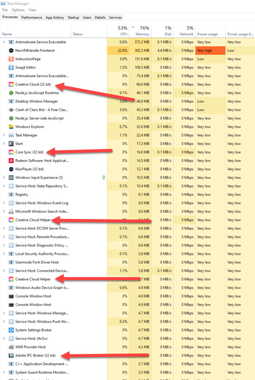
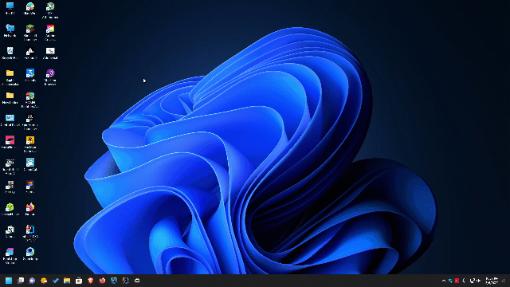

# Adobe-Background-Process-Killer
Using this you can stop all Adobe Background Process to end in one click

**RED Arrows Show Background Process**

Double click **Adobe.bat** file and all Adobe Process will be stopped

And you can use sysinternals suite to stop creative cloud process in boot time
**https://www.microsoft.com/store/productId/9P7KNL5RWT25**

Click Windows key open start menu and search **Autoruns** and click run as administrator **!important**

Disable this entry's only and  adobe update services will not run on startup

